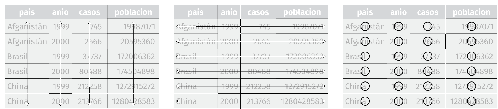

```{r include=FALSE}
knitr::opts_chunk$set(echo = TRUE, fig.path="www/")
library(knitr)
library(pander)
library(kableExtra)
suppressPackageStartupMessages(library(tidyverse))
panderOptions('table.split.table', Inf)
panderOptions('decimal.mark', ",")
panderOptions('big.mark', ".")
panderOptions('missing', "")
options(knitr.kable.NA = '')
```

## 2.3. Preparación de los datos

<br>

En el temario de Programación en R, se introdujeron las funciones básicas de R para tratar datos. Este capítulo va ampliar algunas de estas funciones y va a dar una serie de estrategias de preparación de datos, de forma estructurada, con el objetivo de facilitar las posteriores etapas de análisis de datos.

<br>

### 2.3.1 Seleccionar

<br>

#### Selección de filas y columnas

<br>

En el capítulo 1 ya se ha comentado el uso de las funciones del paquete [dplyr](https://dplyr.tidyverse.org/) para seleccionar filas o columnas.

<br>

```{r}
library(datos)
```

```{r, eval=FALSE}
paises %>% filter(anio == 2007) %>% select(pais,esperanza_de_vida) %>% head()
```

```{r echo=FALSE, results='hide', warning=FALSE}
kable(paises %>% filter(anio == 2007) %>% select(pais,esperanza_de_vida) %>% head(), "html", booktabs=TRUE) %>%
  kable_styling(bootstrap_options=c("striped", "hover", "condensed", "responsive")
                ,font_size = 11,full_width = F) %>%
  save_kable("temp/paises101.png")
```

{width=230px}

<br>

#### Análisis de inconsistencias.

<br>

El análisis de inconsistencias consiste en programar un conjunto de indicadores que permitan descubrir valores fuera del rango o combinaciones de columnas sin sentido.

##### Actividad guiada 2.1.

Pongamos un ejemplo a través de los planetas de la saga de Star Wars. 

<br>

```{r}
load("www/swapi.RData")

planets_df_c <- planets_df %>% mutate(inc_001 = (diameter == "0")
                                    ,inc_002 = (rotation_period == "0")
                                    ,inc_003 = (orbital_period == "0")
                                    ,inc_004 = (surface_water == "0")
                                    ) 
```

<br>

Los nuevos indicadores tiene valor TRUE si la columna original vale "0".

<br>

> \<recuerda\>Es aconsejable almacenar las inconsistencias en columnas indicadores como "inc_001"...  para facilitar su reutilización en las siguientes etapas del tratamiento de datos.\</recuerda\>

<br>

Vemos el recuento de buenos y malos.

<br>

```{r, eval=FALSE}
planets_df_c %>% select(starts_with("inc_")) %>% summary()
```

```{r echo=FALSE, results='hide', warning=FALSE}
kable(planets_df_c %>% select(starts_with("inc_")) %>% summary()
 , "html", booktabs=TRUE) %>%
  kable_styling(bootstrap_options=c("striped", "hover", "condensed", "responsive")
  ,font_size = 11,full_width = F) %>%
  save_kable("temp/swapi101.png")
```

{width=400px}

<br>

> \<sabías que\>La función *starts_with()* de la librería *tidyselect* permite seleccionar todas las variables que empiezan por una cierta cadena de texto. Busca en *?starts_with* otras funciones tydiselect.\</sabías que\>

<br>

Para obtener los planetas con alguna de estas condiciones a TRUE. 

<br>

```{r, eval=FALSE}
planets_df_c %>% filter(inc_001 | inc_002 | inc_003 | inc_004) %>% 
  select(name,diameter,inc_001,rotation_period,inc_002,orbital_period,inc_003,surface_water,inc_004) 
```

```{r echo=FALSE, results='hide', warning=FALSE}
kable(planets_df_c %>% filter(inc_001 | inc_002 | inc_003 | inc_004) %>% select(name,diameter,inc_001,rotation_period,inc_002,orbital_period,inc_003,surface_water,inc_004) 
 , "html", booktabs=TRUE) %>%
  kable_styling(bootstrap_options=c("striped", "hover", "condensed", "responsive")
  ,font_size = 11,full_width = F) %>%
  save_kable("temp/swapi102.png")
```

{width=750px}

<br>

A la luz de estos datos y después de consultar al resto del consejo de maestros Jedis, se decide aplicar los siguientes tratamientos.

<br>

- Eliminar el planeta "unknown" por mala calidad de los datos.
- Corregir a *NA* los valores 0 de "diámetro", periodo de "rotación" y "orbital". 
- Mantener los 0 de "Superficie del agua" debido a que son planetas secos.

<br>

Aplicamos el tratamiento.

<br>

```{r}
planets_df_c <- planets_df_c %>% filter(!name == 'unknown') %>% 
  mutate(diameter_c = ifelse(inc_001,NA,diameter)
         ,rotation_period_c = ifelse(inc_002,NA,rotation_period)
         ,orbital_period_c = ifelse(inc_003,NA,orbital_period))
```

<br>

La tabla original tenía `r nrow(planets_df)` planetas y la nueva tabla limpia contiene `r nrow(planets_df_c)`. 

<br>

> \<importante\>Las transformaciones típicamente se almacenen, temporalmente, en columnas nuevas, así se puede seguir la traza de los cambios realizados.\</importante\>

<br>

### 2.3.2. Estructurar

<br>

Este apartado utiliza el enfoque de Hadley Wickham sobre el concepto de "Datos Ordenados" o "Tidy Data".

<br>

> \<cita\>"Datos ordenados" es un conjunto de datos que ha sido estructurado de forma que cada variable es una columna y cada observación (o caso) es una fila. -  H. Wickham 2013. [Journal of Statistical Software](https://www.jstatsoft.org/index.php/jss/article/view/v059i10/v59i10.pdf)\</cita\>

<br>

Para resaltar la importancia de esta etapa, [G.Glolemun y H.Wickham, 2017](https://es.r4ds.hadley.nz/) utiliza la siguiente cita y su posterior adaptación. 

<br>

> “Todas las familias felices se parecen unas a otras, pero cada familia infeliz lo es a su manera.” –– León Tolstoy

<br>

> “Todos los set de datos ordenados se parecen unos a otros, pero cada set de datos desordenado lo es a su manera” — Hadley Wickham

<br>

En la misma referencia, se explica tres reglas que hacen que un conjunto de datos sea ordenado:

<br>

- Cada variable debe tener su propia columna.
- Cada observación debe tener su propia fila.
- Cada valor debe tener su propia celda.

<br>

También se utiliza la siguiente figura para visualizar mejor estas reglas.

<br>

{width=850px}

<br>

Com puedes ver, la definición de tidy data, equipara las columnas de la tabla con el concepto de **Variable**, así como las filas a observaciones, hecho que simplifica enormemente las posteriores fases de análisis de la información.

#### Pivotar

<br>

Una vez se han identificado las observaciones y las varibles dentro de la tabla, habitualmente nos podemos encontrar con dos problemas:

1. Una variable se extiende por varias columnas.
2. Una observación está dispersa entre múltiples filas.

<br>

##### Pivotar datos "long"

<br>

Es muy frecuente que los nombres de las columnas no representen nombres de variables, sino representan valores de una variable. 

Observa este ejemplo.

<br>

```{r, eval=FALSE}
tabla4a
```

```{r echo=FALSE, results='hide', warning=FALSE}
kable(tabla4a, "html", booktabs=TRUE) %>%
  kable_styling(bootstrap_options=c("striped", "hover", "condensed", "responsive")
  ,font_size = 11,full_width = F) %>%
  save_kable("temp/tabla4a.png")
```

{width=200px}

Para convertir esta tabla en una tabla ordenada, se utiliza la función *pivot_longer()* con 3 parámetros.

<br>

- *cols*:  Columnas que son valores y no variables.
- *names_to*: Nombre de la variable que contendrá los nombre de las columnas previas.
- *values_to*: Nombre de la variable que va a contener los valores de columnas previas.

<br>

```{r, eval=FALSE}
tabla4a %>%
  pivot_longer(cols = c(`1999`, `2000`), names_to = "anio", values_to = "casos")
```

```{r echo=FALSE, results='hide', warning=FALSE}
kable(tabla4a %>%
  pivot_longer(cols = c(`1999`, `2000`), names_to = "anio", values_to = "casos")
, "html", booktabs=TRUE) %>%
  kable_styling(bootstrap_options=c("striped", "hover", "condensed", "responsive")
  ,font_size = 11,full_width = F) %>%
  save_kable("temp/tabla4a101.png")
```

{width=175px}

<br>

> \<importante\>Ahora una observación ya no es un país, sino un país-año. Esta decisión es importante que se tome al inicio de la etapa de la preparación de los datos.\</importante\>

<br>

##### Pivotar datos "wide"

<br>

Si por el contratio una obsrvación aparece en múltiples filas, hablamos de datos *wide*.

Veamos un ejemplo.

<br>

```{r eval=FALSE}
tabla2
```

```{r echo=FALSE, results='hide', warning=FALSE}
kable(tabla2, "html", booktabs=TRUE) %>%
  kable_styling(bootstrap_options=c("striped", "hover", "condensed", "responsive")
  ,font_size = 11,full_width = F) %>%
  save_kable("temp/tabla2.png")
```

{width=300px}

<br>

En este caso para pasar a tabla ordenada, se utiliza la función *pivot_wider()* con 2 parámetros.

<br>

- *names_from*: Columna que contiene los nombre de las variables.
- *values_from*: Columna que contiene los valores que van a tomar las variables.

<br>

```{r, eval=FALSE}
tabla2 %>%
  pivot_wider(names_from = tipo, values_from = cuenta)
```

```{r echo=FALSE, results='hide', warning=FALSE}
kable(tabla2 %>%
  pivot_wider(names_from = tipo, values_from = cuenta)
, "html", booktabs=TRUE) %>%
  kable_styling(bootstrap_options=c("striped", "hover", "condensed", "responsive")
  ,font_size = 11,full_width = F) %>%
  save_kable("temp/tabla2101.png")
```

{width=250px}

<br>

#### Separar

<br>

Un segundo bloque de problemas viene cuando una columna contiene más de una variable.

Observa el siguiente ejemplo.

```{r}
tabla3
```

```{r echo=FALSE, results='hide', warning=FALSE}
kable(tabla3, "html", booktabs=TRUE) %>%
  kable_styling(bootstrap_options=c("striped", "hover", "condensed", "responsive")
  ,font_size = 11,full_width = F) %>%
  save_kable("temp/tabla3.png")
```

{width=250px}

<br>

Ahora la columna tasa contiene los valores tanto de casos, como de población, separados por el símbolo */*. Esta forma de almacenar los datos dificulta realizar análisis (medias, desviaciones típicas…), a partir de cada variable por separado. 

Para tratar esta problemática se utiliza la función *separate()*.

```{r eval = FALSE}
tabla3a <- tabla3 %>%
  separate(tasa, into = c("casos", "poblacion"), sep="/")
tabla3a
```

```{r echo=FALSE, results='hide', warning=FALSE}
tabla3a <- tabla3 %>%
  separate(tasa, into = c("casos", "poblacion"), sep="/")
kable(tabla3a, "html", booktabs=TRUE) %>%
  kable_styling(bootstrap_options=c("striped", "hover", "condensed", "responsive")
  ,font_size = 11,full_width = F) %>%
  save_kable("temp/tabla3101.png")
```

{width=250px}

<br>

#### Unir

<br>

La inversa también tiene una función propia llamda *unite()*.

En este caso, vemos como creamos una variable llamada *id* con el año y el nombre del país.

```{r eval=FALSE}
tabla3a %>% 
  unite(id, anio, pais, remove = FALSE)
```

```{r echo=FALSE, results='hide', warning=FALSE}
kable(tabla3a %>% 
  unite(id, anio, pais, remove = FALSE), "html", booktabs=TRUE) %>%
  kable_styling(bootstrap_options=c("striped", "hover", "condensed", "responsive")
  ,font_size = 11,full_width = F) %>%
  save_kable("temp/tabla3102.png")
```

{width=350px}

<br>

En este caso con el parámetro *remove* se evita que desaparezcan las variables originales.

<br>

### 2.3.3. Transformar

<br>

Una vez se ha ordenado una tabla en observaciones y variables, el siguiente paso es mejorar la calidad del contenido de estas variables.

En el apartado *2.3.1 Seleccionar* se ha entroducido varias transformaciones. Vamos ahora a listar de forma sistemática un conjunto de transformaciones necesario para iniciar un análsis de datos consistente.

<br>

#### Conversiones de tipo

<br>

Un primer elemento es analizar el tipo de cada variable y contrastar con el tipo de datos esperado.

Una excelente forma de analizar el tipo de datos es la función *glimpse()* que mejora, en cierta medida, la funcionalidad genérica de *str()* para el caso particular de los data frames.   

<br>

##### Actividad guiada 2.1.

<br>

Reemprendemos aquí la actividad guiada con los datos de *planets_df_c*.

<br>

```{r}
glimpse(planets_df_c)
```

<br>

Se observa algunos desajustes en el tipo de datos. Se propone los siguientes cambios a analizar.

<br>

- **De character a numeric*: diameter_c, rotation_period_c, orbital_period_c, gravity, surface_water y  population.
- **De character a datetime**: created, edited.

Por lo que hace referencia a climate y terrain son variables character con múltiples valores que se van a comentar en etapas posteriores.

Por otro lado las variables de tipo list como residents y films, deberían ir en otras tablas de relación entre tablas: personaje-planeta y films-planeta respectivamente y forman parte de otro tipo de análisis.

<br>

###### De character a numeric

<br>

Veamos ahora el paso de variables character a numeric.

Este paso no siempre es tan simple ya que pasar a numeric puede implicar una pérdida de valores.

De entrada vemos que swapi codifica en numerosos casos los valores faltantes como "unknown". Por lo tanto sería razonable corregir esto previamente.   

A continuación se transforman todas excepto gravity que tiene otros elementos de texto dentro de la variable que se tratarán más adelante. 

<br>

```{r}
corr_txt <- function(x,txt="unknown") ifelse(x==txt,NA,x)

planets_df_c <- planets_df_c %>% mutate(
  diameter_c1 = as.numeric(corr_txt(diameter_c))
  , rotation_period_c1 = as.numeric(corr_txt(rotation_period_c))
  , orbital_period_c1 = as.numeric(corr_txt(orbital_period_c))
  , surface_water_c1 = as.numeric(corr_txt(surface_water))
  , population_c1 = as.numeric(corr_txt(population)))
```

<br>

```{r eval = FALSE}
planets_df_c %>% select(diameter_c1,rotation_period_c1,orbital_period_c1,surface_water_c1,population_c1) %>% summary()
```

```{r echo=FALSE, results='hide', warning=FALSE}
res1 <-planets_df_c %>% select(diameter_c1,rotation_period_c1,orbital_period_c1,surface_water_c1,population_c1) %>% summary()
kable(res1, "html", booktabs=TRUE) %>%
  kable_styling(bootstrap_options=c("striped", "hover", "condensed", "responsive")
  ,font_size = 11,full_width = F) %>%
  save_kable("temp/swapi105.png")
```

{width=800px}
<br>

###### De Character a datetime

<br>

Dado el formato de entrada, vamos a utilizar la función *as_dateime()* de *lubridate*.

<br>

```{r}
library(lubridate)

planets_df_c <- planets_df_c %>% mutate(
  created_c1 = as_datetime(created)
  , edited_c1 = as_datetime(edited))
```

<br>

```{r eval = FALSE}
planets_df_c %>% select(created_c1,edited_c1) %>% summary()
```

```{r echo=FALSE, results='hide', warning=FALSE}
res1 <- planets_df_c %>% select(created_c1,edited_c1) %>% summary()
kable(res1, "html", booktabs=TRUE) %>%
  kable_styling(bootstrap_options=c("striped", "hover", "condensed", "responsive")
  ,font_size = 11,full_width = F) %>%
  save_kable("temp/swapi106.png")
```

{width=450px}
<br>

#### Manipulación de texto

<br>

Vamos a introducir las funciones del package *stringr* más relevantes para esta etapa: *str_detect()* (reemplazo de *grepl()* de R base), *str_replace_all()* (reemplazo de *gsub()*), *str_trim()* y *str_pad()*.

<br>

#### Buscar texto

<br>

La función *str_detect()* permite buscar de forma vectorial (elmento a elemento) si una cadena de texto contiene cierta expresión regular. 

<br>

> \<recuerda\>El concepto de expresión regular se introdujo en Python en el capítulo Datos digitales. Puedes consultar las expresiones regulares en Stringi en el siguiente [enlace](https://www.rdocumentation.org/packages/stringi/versions/1.5.3/topics/about_search_regex).\</recuerda\>

<br>

Recordemos que en el tema de Programación Python se trabajó con un indicador de planetas con clima tropical o temperado. Veamos ahora una propuesta para construir este indicador en R. 

<br>

```{r}
planets_df_c <- planets_df_c %>% 
  mutate(ind_tropic_temper = str_detect(climate,"temperate|tropical"))
```

<br>

\<sabías que\>Para realizar esta misma operación de búsqueda con R base, puedes utilizar la función grepl(). Consulta la ayuda con ?grepl.\</sabí    as que\>

<br>

  Como siempre que se realiza una transformación, hay que validar que esta ha sido correcta. En este caso, una forma simple es realizar el recuento de planetas con clima tropical o temperado. 

<br>

```{r eval = FALSE}
planets_df_c %>% count(ind_tropic_temper)
```

```{r echo=FALSE, results='hide', warning=FALSE}
res1 <- planets_df_c %>% count(ind_tropic_temper)
kable(res1, "html", booktabs=TRUE) %>%
  kable_styling(bootstrap_options=c("striped", "hover", "condensed", "responsive")
  ,font_size = 11,full_width = F) %>%
  save_kable("temp/swapi107.png")
```

{width=150px}
<br>

Para verificar qué codificación es correcta, ejecuta tu mismo el recuento de valores de clima cuando es temperado o tropical.

<br>

```{r eval = FALSE}
planets_df_c %>% filter(ind_tropic_temper) %>% count(climate)
```

<br>

Lo mismo para los planetas de otros climas.

<br>

```{r eval = FALSE}
planets_df_c %>% filter(!ind_tropic_temper) %>% count(climate)
```

<br>

#### Reemplazar texto

<br>

Para ejemplificar el uso de *str_replace_all()* recuperemos el problema de pasar *gravity* a numérica. Recordemos que esta variable contenía texto mezclado con números.

Un primer intento será reemplazar cualquier carácter alfabético por espacios. Escogemos el espacio para evitar juntar números que antes estuvieran separados. Para detectar los carácteres alfabéticos puedes usar la expresión regular `[\\p{Alphabetic}]`, suponemos aquí que no hay números en notación científica.

<br>

```{r}
planets_df_c <- planets_df_c %>% 
  mutate(gravity_c1 = str_replace_all(gravity
    , "[\\p{Alphabetic}]"," ")) %>% 
  mutate(gravity_c1 = as.numeric(gravity_c1))
```

<br>

Vemos que se han forzado NA en textos no identificados.

<br>

\<sabías que\>Para realizar esta misma operación de reemplazo de texto con R base, puedes utilizar la función gsub().\</sabías que\>

<br>

Para validar que ha ocurrido podemos analizar los recuentos de la variable gravity cuando gravity_c1 es NA.

<br>

```{r eval = FALSE}
planets_df_c %>% 
  filter(is.na(gravity_c1)) %>% 
  count(gravity)
```

```{r echo=FALSE, results='hide', warning=FALSE}
res1 <- planets_df_c %>% 
  filter(is.na(gravity_c1)) %>% 
  count(gravity)
kable(res1, "html", booktabs=TRUE) %>%
  kable_styling(bootstrap_options=c("striped", "hover", "condensed", "responsive")
  ,font_size = 11,full_width = F) %>%
  save_kable("temp/swapi108.png")
```

{width=250px}

<br>

Como puedes ver se trata de valores 14 "unknown", 1 "N/A" y 1 planeta con 2 valores de gravedad 1.5 en superficie y 1 en la ciudad nube.

Para tomar una decisión, el consejo Jedi ha solicitado saber de qué planeta se trata.

<br>

```{r eval = FALSE}
planets_df_c %>% 
  filter(str_detect(gravity,"Cloud City")) %>% 
  select(name,gravity)
```

```{r echo=FALSE, results='hide', warning=FALSE}
res1 <- planets_df_c %>% 
  filter(str_detect(gravity,"Cloud City")) %>% 
  select(name,gravity)
kable(res1, "html", booktabs=TRUE) %>%
  kable_styling(bootstrap_options=c("striped", "hover", "condensed", "responsive")
  ,font_size = 11,full_width = F) %>%
  save_kable("temp/swapi109.png")
```

{width=400px}

<br>

Vemos que se trata de la ciudad nube e Bespin Bespin. El consejo Jedi, decide optar por el peor de los dos valores, es decir 1.5.

Recodificamos el caso de Bespin sobre la misma variable *gravity_c1*.

<br>

```{r}
planets_df_c <- planets_df_c %>% 
  mutate(gravity_c1 = ifelse(name=="Bespin",1,gravity_c1))
```

<br>

Validamos con un simple summary.

<br>

```{r eval = FALSE}
planets_df_c %>% select(gravity_c1) %>% summary()
```

```{r echo=FALSE, results='hide', warning=FALSE}
res1 <- planets_df_c %>% select(gravity_c1) %>% summary()
kable(res1, "html", booktabs=TRUE) %>%
  kable_styling(bootstrap_options=c("striped", "hover", "condensed", "responsive")
  ,font_size = 11,full_width = F) %>%
  save_kable("temp/swapi110.png")
```

{width=150px}

<br>

Observa que la nueva variable *gravity_c1*, devuelve 15 NA que es el valor que esperábamos.

<br>

#### Recortar texto

<br>

La función *str_trim()* permite recortar espacios en blanco con opción de seleccionar si recortar a derecha, izquierda o a ambos lados con el parámetro: *side = c("both", "left", "right")*.

<br>

```{r}
str_trim(" hola mundo ")
str_trim(" hola mundo ", side = "left")
str_trim(" hola mundo ", side = "right")
```

<br>

\<sabías que\> Para realizar esta misma operación de reemplazo de texto con R base, puedes utilizar la función trim <- function (x) gsub("^\\s+|\\s+$", "", x) .\</ sabías que \>

<br>

Otra opción interesante es *str_squish()* que permite eliminar varios espacios consecutivos, dentro de un texto además del espacio a ambos lados :

<br>

```{r}
str_squish("  Aquí     hay       mucho     espacio   ")
```

<br>

Prueba a realizar la misma operación de str_squish, a partir de expresiones regulares.

<br>

#### Ampliar textos

<br>

Típicamente se utiliza en códigos postales, u otros identificadores con una estructura prefijada.

<br>

```{r}
str_pad(112, width = 5, side = "left", pad = 0)

```

#### Mayúsculas y minúsculas

<br>

Forma parte de las tareas típicas de normalización de textos.

```{r}
toupper("Hola mundo")
tolower("Hola Mundo")
```

<br>

#### Otros tratamientos de texto

<br>

Como si se tratase de un traje a medida, el análisis de textos implica multitud de transformaciones. Se comentan a continuación algunos habituales. 

<br>

##### Caracteres no alfanuméricos

<br>

```{r}
x <- "1s~!ec@#$%^&*(){}r_+:\"e<>?,t./;'o[]-="
str_squish(str_replace_all(x, "[^[:alnum:]]", " "))
```

<br>

##### Acentuación y letras especiales

<br>

```{r}
txt <- "ÁbcdêÑãçoïàúü"
iconv(txt, from="Latin1", to="ASCII//TRANSLIT")
#iconv(txt, from="UFT-8", to="ASCII//TRANSLIT") # si estas en Linux o Mac
```

<br>

### 2.3.4. Codificar

<br>

Las variables de tipo *character*, habitualmente se codifican de alguna forma para facilitar su análisis posterior.

Se puede distinguir entre variables con un solo valor posible, por ejemplo género (en el caso de Star Wars, female, hermaphrodite o male), de variables que pueden tomar varios valores posibles, por ejemplo clima del planeta, ya que un planeta puede tener varios climas.

Las primeras, típicamente se transforman a variables de tipo factor, siempre que el listado de valores posibles sea acotado (inferior al número de observaciones).

<br>


```{r}
people_df_c <- people_df %>% 
  mutate(gender_c1 = 
           as.factor(ifelse(str_detect(gender,"unkown|n/a|none"),NA,gender)))
```

<br>

Como siempre, hay que validar que el resultado sea correcto.

<br>

```{r eval = FALSE}
people_df_c %>% count(gender_c1)
```

```{r echo=FALSE, results='hide', warning=FALSE}
res1 <- people_df_c %>% count(gender_c1)
kable(res1, "html", booktabs=TRUE) %>%
  kable_styling(bootstrap_options=c("striped", "hover", "condensed", "responsive")
  ,font_size = 11,full_width = F) %>%
  save_kable("temp/swapi111.png")
```

{width=150px}

<br>

Quedan 4 personajes sin género, que corresponden a robots. Esto se comentará en la etapa de análisis de valores faltantes.

<br>

#### Variables multirespuesta

<br>

En el caso de variables con varias respuestas posibles, a continuación se comentan distintas soluciones posibles.

<br>

- Codificar una variable indicador para cada posible categoría.
- Escoger un cierto orden dentro de las categorías (o dentro de cada individuo) y quedarse con la primera (o N primeras) respuestas.

<br>

Veamos un ejemplo de cada caso para el caso de la variable clima. En primer lugar, necesitamos la lista de códigos posibles. Para esto se utiliza str_split().

<br>

```{r}
clima_list <- lapply(planets_df_c$climate
                   ,function(x) sapply(str_split(x,","),str_squish))
clima_vec <-unlist(clima_list)
cod_clima <-unique(clima_vec)
```

```{r eval = FALSE}
sort(table(clima_vec))
```

```{r echo=FALSE, results='hide', warning=FALSE}
res1 <- sort(table(clima_vec))
kable(res1, "html", booktabs=TRUE) %>%
  kable_styling(bootstrap_options=c("striped", "hover", "condensed", "responsive")
  ,font_size = 11,full_width = F) %>%
  save_kable("temp/swapi112.png")
```

{width=200px}

<br>

A partir de esta lista se ha acordado, con el consejo Jedi, la siguiente   agrupación de los climas que cumpla con una cierta lógica y que evite valores con poca frecuencia de casos informados.  

<br>

```{r}
list_clima_rec<-list()
list_clima_rec[["frio"]] <- c("artic", "frozen", "subartic", "frigid")
list_clima_rec[["tropical"]] <- c("humid","moist", "tropical","hot", "superheated")
list_clima_rec[["seco"]] <- c("arid", "rocky", "windy","murky", "polluted")
list_clima_rec[["temperado"]] <- c("artificial temperate", "temperate")
```

<br>

Observa que la lista se ha ordenado de menor a mayor frecuencia observada.

A partir de la lista anterior, se han creado las variables indicador:

<br>

```{r}
for (clima_name in names(list_clima_rec)){
  planets_df_c[[paste0("clim_",clima_name)]] <- str_detect(planets_df_c$climate
    ,paste(list_clima_rec[[clima_name]],collapse = "|"))
}
```

<br>

También se ha acordado, con el consejo Jedi, crear las variables con el primer clima informado, según el orden de la lista *list_clima_rec* (de menor a mayor frecuencia observada). 

<br>

```{r}
planets_df_c[["clima_discriminante"]]<- as.factor(planets_df_c %>% 
  select(starts_with("clim_")) %>% 
  apply(1, function(x) names(which(x))[1]))
```

<br>

Veamos la validación de todas ellas.

<br>

```{r}
planets_df_c %>% 
  select(starts_with("clim_"),clima_discriminante) %>% 
  summary()
```

<br>


```{r echo=FALSE, results='hide', warning=FALSE}
res1 <- planets_df_c %>% 
  select(starts_with("clim_"),clima_discriminante) %>% 
  summary()
kable(res1, "html", booktabs=TRUE) %>%
  kable_styling(bootstrap_options=c("striped", "hover", "condensed", "responsive")
  ,font_size = 11,full_width = F) %>%
  save_kable("temp/swapi113.png")
```

{width=800px}

<br>

## Bibligrafía

<br>

- Wickham, Hadley (20 February 2013). "Tidy Data" (PDF). Journal of Statistical Software.

- https://es.r4ds.hadley.nz/

- https://www.jstatsoft.org/index.php/jss/article/view/v059i10/v59i10.pdf
  
  
- https://rpubs.com/williamsurles/291107

- https://cran.r-project.org/doc/contrib/de_Jonge+van_der_Loo-Introduction_to_data_cleaning_with_R.pdf

