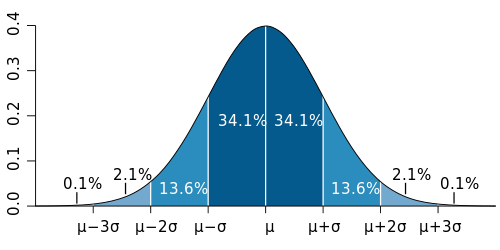

```{r include=FALSE}
knitr::opts_chunk$set(echo = TRUE, fig.path="www/")
library(knitr)
library(pander)
library(kableExtra)
suppressPackageStartupMessages(library(tidyverse))
panderOptions('table.split.table', Inf)
panderOptions('decimal.mark', ",")
panderOptions('big.mark', ".")
panderOptions('missing', "")
options(knitr.kable.NA = '')
```

## 2.5. Calidad de los datos

<br>

La calidad de datos es la tercera etapa dentro del ciclo de gestión de datos presentado en la introducción:

<br>

1. Preparación de datos
2. Métricas
3. Calidad de datos
4. Muestreo

<br>

Una vez preparados los datos y analizadas las transformaciones más adecuadas para conseguir mejores métricas, es el momento de analizar y corregir problemas de calidad de datos derivados de la presencia de valores extremos, así como, analizar e imputar valores faltantes.

<br>

### 2.5.1. Valores extremos

<br>

#### Definición

<br>

Los valores extremos o valores atípicos (en inglés outliers) en estadística consisten en valores que distan del resto de observaciones. 

<br>

##### ACTIVIDAD GUIADA

Para poner ejemplos concretos sobre outliers y valores faltantes, recuperamos en primer lugar, los datos de los planetas de Star Wars vistos en el tema de Preparación de datos.

En primer lugar cargamos los datos.

<br>

```{r}
suppressPackageStartupMessages(library(tidyverse))

load("www/swapi.RData")
```

<br>

Recuperamos las transformaciones realizadas durante la preparación de datos. 

<br>

```{r}
# Preparacion de datos
corr_txt <- function(x,txt="unknown") ifelse(x==txt,NA,x)

planets_df_c <- planets_df %>% 
  mutate(inc_001 = (diameter == "0")
         , inc_002 = (rotation_period == "0")
         , inc_003 = (orbital_period == "0")
         , inc_004 = (surface_water == "0")
         , diameter_c = ifelse(inc_001,NA,diameter)
         , rotation_period_c = ifelse(inc_002,NA,rotation_period)
         , orbital_period_c = ifelse(inc_003,NA,orbital_period)
         , gravity_c1 = str_replace_all(planets_df$gravity, "[ ,()/\\p{Alphabetic}]","")
         , gravity_c1 = ifelse(name=="Bespin",1,as.numeric(gravity_c1))
         , diameter_c1 = as.numeric(corr_txt(diameter_c))
         , rotation_period_c1 = as.numeric(corr_txt(rotation_period_c))
         , orbital_period_c1 = as.numeric(corr_txt(orbital_period_c))
         , surface_water_c1 = as.numeric(corr_txt(surface_water))
         , population_c1 = as.numeric(corr_txt(population))
         ) %>% 
  filter(!name == 'unknown')
```

<br>

Asignamos el nombre de los planeas a los rownames y se recodifica la variable de clima.

<br>

```{r}
rownames(planets_df_c) <- planets_df_c$name

list_clima_rec<-list()
list_clima_rec[["4_frio"]] <- c("artic", "frozen", "subartic", "frigid")
list_clima_rec[["2_tropical"]] <- c("humid","moist", "tropical","hot", "superheated")
list_clima_rec[["3_seco"]] <- c("arid", "rocky", "windy","murky", "polluted")
list_clima_rec[["1_temperado"]] <- c("artificial temperate", "temperate")

for (clima_name in names(list_clima_rec)){
  planets_df_c[[paste0("clim_",clima_name)]] <- str_detect(planets_df_c$climate
    ,paste(list_clima_rec[[clima_name]],collapse = "|"))
}

planets_df_c[["clima_discriminante"]]<- as.factor(planets_df_c %>% 
  select(starts_with("clim_")) %>% 
  apply(1, function(x) names(which(x))[1]))

```

<br>

Finalmente, se seleccionan las variables de interés y se presenta el resumen univariante.

<br>

```{r}
# diameter_c1,rotation_period_c1,orbital_period_c1,surface_water_c1,gravity_c1,population_c1,clima_discriminante

planets_df_c <- planets_df_c %>% 
  select(name, diameter_c1, orbital_period_c1, surface_water_c1,population_c1, clima_discriminante) %>% 
  filter(is.na(population_c1) | population_c1 > 0)

planets_df_c %>% summary()
```


<br>

Se ha seleccionado los planetas con habitantes ya que se va a analizar esta variable.

<br>


```{r}
dim(planets_df_c)
```

<br>

Finalmente han quedado seleccionados, 58 planetas y 5 variables.

Las variables de interés en este caso serán: el diámetro del planeta, el periodo orbital, el % de superficie del agua, la población del planeta y el clima. 

Observa como todas ellas presentan valores faltantes y en algunos casos, valores máximos muy elevados respecto a la media, mediana ...

<br>

#### Origen de los valores extremos

<br>

Se puede hablar de dos orígenes de valores extremos. Por un lado estos valores pueden aparecer debido a la **variabilidad propia del fenómeno observado**.

Para observar esta variabilidad vemos los boxplot del diámetro y de la población de los planetas de Star Wars.

<br>

```{r, warning=FALSE, message=FALSE}
suppressPackageStartupMessages(library(cowplot))

p1 <- planets_df_c %>% 
  ggplot(aes(x=diameter_c1))+
  geom_boxplot()

p2 <- planets_df_c %>% 
  ggplot(aes(x=population_c1))+
  geom_boxplot()

plot_grid(p1, p2, ncol = 2)
```

<br>

Recordemos que los boxplot, tal y como se ha introducido en el módulo 2, nos sirven para detectar ciertos outliers. Recordemos que estos puntos aislados que sobresalen de los extremos de los bigotes del boxplot. Recordemos que, des del punto de vista numérico, esto sucede cuando:

- El valor es superior a Q3 + 1,5*IQR, donde Q3 es el 3r cuartil y IQR es el rango inter-cuartil (diferencia entre el 3r y 1r cuantil).
- El valor es inferior a Q1 - 1,5*IQR, donde Q1 es el 1r cuartil.

<br>

> \<sabías que\>El caso descrito antes se llama valor típico leve. En el caso que la observación se sitúa por encima de Q3 + 3*IQR (repect. debajo de Q1 - 3*IQR), entonces se  llama valor atípico extremo.\</sabías que\>

<br>

El ejemplo, vemos que tanto el diámetro, como la población de los planetas tiene casos outliers que aparecen debido a la propia dispersión de la variable.

En este sentido vemos varios planetas con diámetros extremos, tanto a derecha como a izquierda y varios planetas con valores de población muy elevados.

Antes de comentar la segunda fuente de outliers, es necesario recordar que en el apartado de métricas, se ha comentado que las variable positivas con asimetrías positivas como las observadas en ambas variables es habitual que puedan ocultar distribuciones de tipo logarítmico. 

Veamos como quedarían los boxplots, después de aplicar la transformación logarítmica.

<br>

```{r, warning=FALSE, message=FALSE}
p3 <- planets_df_c %>% 
  ggplot(aes(x=log(diameter_c1)))+
  geom_boxplot()

p4 <- planets_df_c %>% 
  ggplot(aes(x=log(population_c1 )))+
  geom_boxplot()

plot_grid(p1, p2, p3, p4, nrow = 2)
```

<br>

Observa como la dispersión de la variable diámetro una vez se ha aplicado la transformación logarítmica (abajo a la izquierda), muestra 3 outliers con valores por debajo del resto y un oulier con valores superiores al resto. Este comportamiento es similar a la variable original (arriba a la izquierda), si bien, observa como algunos valore que quedaban ligeramente por encima de la caja, han sido absorbidos por la caja de log(diameter_c1).

Por contra, la variable población, una vez se ha transformado con el logaritmo (abajo a la derecha), ha cambiado completamente su comportamiento, pasando de mostrar varios outliers con valores altos (arriba derecha), a mostrar un único valor extremo precisamente en el sentido contrario, es decir, con muy pocos habitante respecto al resto.

Este comportamiento nos lleva a pensar que el concepto de valor extremo, está intrínsecamente ligado a la métrica (por lo tanto, distancia) seleccionada. La decisión de utilizar una métrica u otra, dependerá del analista de datos y de la naturaleza de los datos a analizar.

La segunda fuente de errores, y no menos frecuente, es el **error en la medida tomada durante el experimento**. En este último caso, la decisión seria volver a tomar la medida, o bien, descartar la observación errónea. 

Un ejemplo típico, aquí es, la presencia de personas en la base de datos, de más de 120 años de edad. Medida claramente erronea (excepto si se trata de un personaje de Star Wars como Yoda).

El análisis sistemático de los outliers permite aislar estos valores extraños y, de forma coordinada con los expertos en los datos analizados, tomar decisiones respecto al origen del error.

<br>

#### Outliers en distribuciones normales

<br>

En el caso de variables con distribuciones normales, una forma muy habitual de detectar outliers es a través de la distancia sobre la media, medida en términos de número de desviaciones típicas.

En este sentido, en distribuciones normales, a partir del conocimiento de esta distribución, sabemos que:

<br>

- Un valor se aleja más de 2 (1.96 par ser exactos) desviaciones típicas respecto a la media en el 5% de casos
- Un valor se aleja en más de 3 desviaciones típicas sobre la media en el 0,2% (0,27% para ser exactos) de los casos.

<br>

##### Distribución de probabilidades

<br>

Puedes ver este hecho en el siguiente gráfico de la distribución normal de media 0 y desviación típica 1.

<br>



<br>

En R para obtener estas probabilidades puedes utilizar la función pnorm().

<br>

```{r}
round(2*(1-pnorm(1.96)),4)
```

<br>

A través de pnorm() se cuantifica el área de la curva de la distribución normal estndar (media 0 y desviación típica 1) por debajo de una cierto valor. Por lo tanto, 1-pnorm(1.96) nos da el área de la cola por encima de 1,96. Como la distribución normal es simétrica, para sumar el área tanto de la cola superior como la inferior, se puede hacer con 2*(1-pnorm(1.96)).

Veamos el área de las 2 colas cuando nos alejamos 3 desviacions típicas respecto la media.

<br>

```{r}
round(2*(1-pnorm(3)),4)
```

<br>

Es decir, que para una muestra de datos que siga esta distribución normal, sólo el 0,27% de las observaciones deberían tener un valor a distancia 3 veces la desviación típica de la muestra.

Para analizar un ejemplo, recordemos la distribución del número de habitantes de los planetas de Star Wars transformada logarítmica.

<br>

```{r, warning=FALSE, message=FALSE}
pop.mean <- mean(log(planets_df_c$population_c1),na.rm=TRUE)
pop.sd <- sd(log(planets_df_c$population_c1),na.rm=TRUE)

planets_df_c %>% 
  ggplot(aes(x=log(population_c1)))+
  geom_density(aes(y=..density..,), color="blue") +
  stat_function(fun = dnorm, color="red", args = list(mean = pop.mean, sd = pop.sd))

```

<br>

En el gráfico vemos la densidad del logaritmo de los habitantes en azul y la densidad de la distribución normal en rojo.

<br>

##### Gráficos Cuantil-Cuantil (Q-Q plots)

<br>

Una forma de contrastar el grado de similitud de esta distribución con la distribución normal es a través del [gráfico Cuantil-Cuantil](https://es.wikipedia.org/wiki/Gr%C3%A1fico_Q-Q) (o Q-Q plot)

Este gráfico permite analizar en que grado la distribución observada (eje y del gráfico), se asemeja a la esperada (eje x de gráfico) según la distribución normal. 


<br>

```{r}
qqnorm(log(planets_df_c$population_c1))
qqline(log(planets_df_c$population_c1), col = 2)
```

<br>

En el caso que todos los puntos estés obre la diagonal (línea roja), significa que la distribución observa es muy similar a la esperada y por lo tanto es razonable pensar que tenga esta distribución.

En nuestro caso, si bien, se observan algunas desviaciones, es razonable pensar que se asemeja a la distribución normal.


<br>

##### Tipificación de la variable

<br>


Para calcular la distancia en desviaciones típicas respecto la media, una operación habitual, es la tipificación de la variable introducida en el módulo 2.

Recordemos que esta operación corresponde a restar la media y dividir por la desviación típica. El resultado de este procedimiento será una nueva variable de media 0 y desviación típica 1.

En R, para realizar esta operación de tipo vectorial, se utiliza la función scale().

Aplicamos esta transformación sobre log(population_c1) para verificar que efectivamente la variable queda estandarizada.

<br>

```{r}
planets_df_c %>% 
  mutate(z = scale(log(population_c1))) %>% 
  summarise(media = round(mean(z, na.rm=TRUE),10)
            ,desv_tip= round(sd(z, na.rm=TRUE),10))
```

<br>

Una vez se ha estandarizado la variable, para verificar si hay valores a distancia superior a 1.96 se puede hacer mediante la siguiente operación.

<br>


```{r}
planets_df_c %>% 
  filter(scale(log(population_c1)) > 1.96) %>% 
  nrow()
```

<br>

Vemos que no hay ningún planeta que tenga valores de habitantes (en escala logarítmica) a distancia mayor de 1.96 desviaciones típicas respecto la media. Esto indica que en hipótesis de normalidad, no los habitantes (en escala logarítmica) no tiene valores outliers.

Veamos lo mismo ahora con el diámetro de los planetas. Primero revisamos la densidad.

<br>

```{r, warning=FALSE, message=FALSE}
pop.mean <- mean(log(planets_df_c$diameter_c1),na.rm=TRUE)
pop.sd <- sd(log(planets_df_c$diameter_c1),na.rm=TRUE)

planets_df_c %>% 
  ggplot(aes(x=log(diameter_c1)))+
  geom_density(aes(y=..density..,), color="blue") +
  stat_function(fun = dnorm, color="red", args = list(mean = pop.mean, sd = pop.sd))

```

<br>

Se observa que hay una mayor concentración en el centro de la distribución (forma leptocúrtica) que, en el caso de la normal, no obstante, el nivel de simetría parece razonable. 

Vemos los gráficos Q-Q plot.

<br>

```{r}
qqnorm(log(planets_df_c$diameter_c1))
qqline(log(planets_df_c$diameter_c1), col = 2)
```

<br>

Observamos que, efectivamente, muchos cuantiles están bien alineados con los cuantiles de la distribución normal. 

Vemos ahora si hay diámetros a distancia superior a 1,96 desviaciones típicas de la media.


```{r}
planets_df_c %>% 
  filter(scale(log(diameter_c1)) > 1.96)
```

<br>

Para saber a qué distancia está.

<br>

```{r}
planets_df_c %>% 
  mutate(z=scale(log(diameter_c1))) %>% 
  filter(z > 1.96) %>% 
  select(z)
```

<br>

Vemos que Bespin tiene un diámetro que, en escala logarítmica, está a 4,5 desviaciones  típicas de la media. Por lo tanto, indica que en hipótesis de normalidad se trata de un valor outlier.

<br>

#### Medias truncadas

<br>

Como se ha comentado en el módulo 2, la media de una muestra de datos puede estar muy afectada por la presencia de outliers. Para corregir este efecto, un estadístico que se utiliza de forma habitual es la **media truncada** del $\alpha$% (habitualmente 5%). Este consiste en la media de las observaciones, una vez se ha eliminado el $\alpha$%/2  (habitualmente 2,5%) de observaciones a cada lado de la distribución.

En R la misma función mean() implementa el parámetro trim. vemos un ejemplo de la variable diámetro (tanto en nivel como en escala log).

<br>

```{r}
planets_df_c %>% 
  summarise(media_nivel = mean(diameter_c1, na.rm=TRUE)
            ,media_nivel_trunc = mean(diameter_c1, trim=0.05, na.rm=TRUE)
            ,media_log = mean(log(diameter_c1), na.rm=TRUE)
            ,media_log_trunc = mean(log(diameter_c1), trim=0.05, na.rm=TRUE))
```

<br>

Observa como al recortar la variable en nivel, la variación entre la media aritmética y la media recortada es mucho mayor (en términos absolutos y relativos) que en el caso de la variable en escala log.

Por lo tanto, es un tratamiento útil, no obstante, en distribuciones transformadas mediante logaritmos, no parece muy necesario su uso.

<br>

#### Valores atípicos en la regresión

<br>

Los outliers, aparte de afectar la media de una variable también pueden afectar en la recta de regresión estimada.

Para visualizar este impacto, vemos un ejemplo de como afecta a la relación entre diámetro y población del ejemplo de planeta de Star Wars.

<br>

```{r, warning=FALSE, message=FALSE}
planets_df_c %>% 
  ggplot(aes(x=log(diameter_c1), y=log(population_c1))) +
  geom_point()+
  geom_text(data=planets_df_c %>% filter(name == "Bespin") 
            ,aes(x=log(diameter_c1), y=log(population_c1), label=name)) +
  geom_smooth(method='lm', se=FALSE, aes(color = "lm_Con")) +
  geom_smooth(data=planets_df_c %>% filter(name != "Bespin"),
              method='lm', se=FALSE, aes(color = "lm_Sin",
                x=log(diameter_c1), y=log(population_c1)))
```

<br>

El impacto de incluir y no el valor outlier se puede medir de forma simple en términos de correlación de Pearson.

<br>

```{r}
data.frame(
cor_con=with(planets_df_c, cor(log(diameter_c1),log(population_c1), use="complete.obs"))
,cor_sin= with(planets_df_c %>% mutate(nom=rownames(planets_df_c)) %>% 
                 filter(nom != "Bespin")
  , cor(log(diameter_c1),log(population_c1), use="complete.obs")))
```

<br>

Vemos como la eliminación de un único outlier incrementa la correlación en 0.25.

Para poder realizar el diagnóstico de estos outliers, R facilita el trabajo a través de 3 gráficos de la regresión obtenida mediante la función lm().

Por un lado, vemos el primer gráfico donde se visualiza el residuo del modelo en relación al valor estimado.

<br>

```{r}
model1 <- lm(log(population_c1) ~ log(diameter_c1), data=planets_df_c)

plot(model1, 1)
```

<br>

En el eje y se visualiza el residuo de la regresión, es decir: $y_{i} - \widehat{y}_{i}$.

En el eje x la predicción del modelo: $\widehat{y}_{i}$.

Este gráfico muestra como Bespin (abajo a la derecha), tiene un comportamiento muy distinto al resto: valor estimado muy alto, residuo muy negativo.

El segundo gráfico muestra la relación entre el residuo tipificado y el [leverage](https://en.wikipedia.org/wiki/Leverage_(statistics)) , definido por la diagonal de la matriz de variables independientes de la regresión como: $h=X(X^T X)^{-1}X^T$.

<br>

```{r}
plot(model1, 5)
```

<br>

El leverage (eje x) es una medida conjunta de desviación sobre la media. Por lo tanto, es una forma alternativa de analizar si una observación, potencialmente es un valor extremo.

En el gráfico se observa que Bespin, además tiene un residuo tipificado inferior a -2, por lo tanto, esto junto a que tiene n leverage muy elevado confirma que tiene un impacto muy elevado en los coeficientes de la regresión lineal.

R además aporta un tercer gráfico que permite cuantificar este impacto mediante una distancia, la [Distancia de Cook](https://en.wikipedia.org/wiki/Cook%27s_distance). Esta se define como : $D_i = \frac{e_i^2}{p s^2}\left[\frac{h_{ii}}{(1-h_{ii})^2}\right]$,

Dónde:

<br>

- $e_i^2$: Es el residuo i-ésimo al cuadrado.
- $h_{ii}$: es el leverage del elemento i-ésimo 
- p: Es el número de variables independientes (teniendo en cuenta la constate)
- $e_i^2$: es el error medio cuadrático del modelo.

<br>

```{r}
plot(model1, 4)
```

<br>

El gráfico muestra Bespin con un valor de D de Cook > 1 (valor de referencia habitual) y sin duda muy superior al resto.

Esto estaría indicando que este outlier está impactando significativamente sobre los coeficientes de la regresión y que, en caso que este efecto no sea deseable estaría surgiendo eliminar este valor de la muestra para así calcular la recta de regresión sin este elemento.

<br>

> \<sabías que\>Puede analizar estas y otras medias de influencia a través de la función influence.measures(), consulta en la ayuda de R para saber más.\<sabías que\>

<br>

#### Regresiones robustas frente ouliers

<br>

Una forma de analizar si la regresión lineal está muy impactada por los outliers o nom es a través de concepto de [regresión robusta](https://es.wikipedia.org/wiki/Regresi%C3%B3n_robusta). Esta regresión engloba un conjunto de distintas técnicas enfocadas a evitar las limitaciones del modelo de mínimos cuadrados.

Uno de ellos es el método de los M-estimadores de Peter J. Huber 1973. Este método funciona bien cuando hay presencia de outliers en la variable dependente pero no aporta mejoras cuando el outlier esta presente en la variable independiente.

En R, este método de regresión robusta, viene implementado en la función rlm() de la libreria MASS.

Veamos el impacto de rlm sobre la regresión analizada.

<br>

```{r, warning=FALSE, message=FALSE}
library(MASS)
planets_df_c %>% 
  ggplot(aes(x=log(diameter_c1), y=log(population_c1))) +
  geom_point()+
  geom_text(data=planets_df_c %>% filter(name == "Bespin") 
            ,aes(x=log(diameter_c1), y=log(population_c1), label=name)) +
  geom_smooth(method='lm', se=FALSE, aes(color = "lm_Con")) +
  geom_smooth(data=planets_df_c %>% filter(name != "Bespin"),
              method='lm', se=FALSE, aes(color = "lm_Sin",
                x=log(diameter_c1), y=log(population_c1)))+
  geom_smooth(method='rlm', se=FALSE, aes(color = "rlm_Con"))
```

<br>

Observa como efectivamente rlm() (recta azul) ha realizado una pequeña corrección haciendo que la recta se aun poco más parecida a la recta del modelo lm sin Bespin.

<br>

#### Trucado de la variable

<br>

Una forma de corregir problemas de outliers predictores consiste en el trucando la variable mediante algún cuantil. Por ejemplo, cuantil 95% si se trata de un outlier de valores altos o cuantil 5% para valores bajos.

Vemos un ejemplo.

```{r, warning=FALSE, message=FALSE}
planets_df_c %>% 
    mutate(diameter_c1_trunc=ifelse(diameter_c1<quantile(diameter_c1,.95,na.rm=TRUE)
      ,diameter_c1, quantile(diameter_c1,.95,na.rm=TRUE))) %>% 
  ggplot(aes(x=log(diameter_c1), y=log(population_c1))) +
  geom_point()+
  geom_text(data=planets_df_c %>% filter(name == "Bespin") 
            ,aes(x=log(diameter_c1), y=log(population_c1), label=name)) +
  geom_smooth(method='lm', se=FALSE, aes(color = "lm_Con")) +
  geom_smooth(data=planets_df_c %>% filter(name != "Bespin"),
              method='lm', se=FALSE, aes(color = "lm_Sin",
                x=log(diameter_c1), y=log(population_c1)))+
  geom_smooth(method='rlm', se=FALSE, aes(color = "rlm_Con"))+
  geom_smooth(method='lm', se=FALSE, aes(color = "lm_trunc",
                x=log(diameter_c1_trunc), y=log(population_c1)))
```

<br>

Observa ahora que la recta de regresión construida con el método de mínimos cuadráticos (función lm()), calculado a partir de los datos truncados de diámetro (línea verde), ahora tiene un gran similitud con el modelo lm() construido sin el valor de Bespin.

A modo de conclusión, comentar que el uso de un modelo u otro dependerá, en gran medida, de las necesidades del analista y de lo expertos en los datos respecto hasta que nivel es deseable que el modelo tenga en cuenta los valores extremos en el modelo. 

<br>


### 2.5.2. Valores faltantes

<br>

Los valores faltantes es un campo de analisis muy amplio. 

Dentro de esta área se aplican soluciones muy simples, como es la eliminación de las observaciones con datos faltantes.

```{r}
planets_df_c_noNA <- na.omit(planets_df_c)

dim(planets_df_c_noNA)
```

<br>

Se ha pasado de 58 planetas a 21 por eliminación.

Por otro lado, en el área de Missing Data, también se utilizan técnicas de análisis extremadamente complejas.

<br>

### 2.5.2. Análisis de valores faltantes

<br>

La función aggr() permite ver el esquema de missing data presente en los datos. 

<br>

```{r message=FALSE, warning=FALSE}
suppressPackageStartupMessages(library(VIM))

aggr(planets_df_c[,c(-1)], lab=c("Diametro","Per_orbit","Por_Agua","N_Hab","Clima"))
```

<br>

El grafico de la izquierda muestra el % de missings.

A la derecha, los azules son bloques informados y los rojos bloques missing.

<br>

### 2.5.3. Imputación de valores faltantes

<br>

El objetivo es completar lo datos faltantes de forma que el nuevo data set tenga una medias y covarianzas parecidas a la población real que se quiere analizar.

<br>

Hay 3 [tipologías de missings](https://en.wikipedia.org/wiki/Missing_data):

<br>

- Missing completely at Random (MCAR):  Los missings aparecen de forma aleatoria e independeinte con el resto de información. Se peude reemplazar estos misings con valores medios o aleatorios sin influir en el resultado final del modelo.
- Missing at Random (MAR):  Los missings se pueden explicar por el resto de datos informados. Este contexto es donde aplcian lo métodos de imputación que se comentan más abajo. 
- Missing not at Random (MNAR):  El motivo que el valor se missing reside en el mismo valor faltante. Por ejemplo, un hombre no participa en un estudio de la depresión porqué tiene depresión.

<br>

En R hay un universo de librerías sobre [missing data](https://cran.r-project.org/web/views/MissingData.html). Algunos relevantes son:

- VIM implementa visualizaciones como las que has visto  y métodos de imputación simples: knn, regresión...
- [mice](https://cran.r-project.org/web/packages/mice/index.html) implementa el algoritmo de [Ecuaciones encadenadas](https://cran.r-project.org/web/packages/miceRanger/vignettes/miceAlgorithm.html) e [imputación múltiple](https://en.wikipedia.org/wiki/Imputation_(statistics)#Multiple_imputation)
- [ImputeR](https://cran.r-project.org/web/packages/imputeR/index.html) ofrece el algoritmo [EM](https://es.wikipedia.org/wiki/Algoritmo_esperanza-maximizaci%C3%B3n).

Prueba las funciones principales de los paquetes a través de los propios ejemplos.